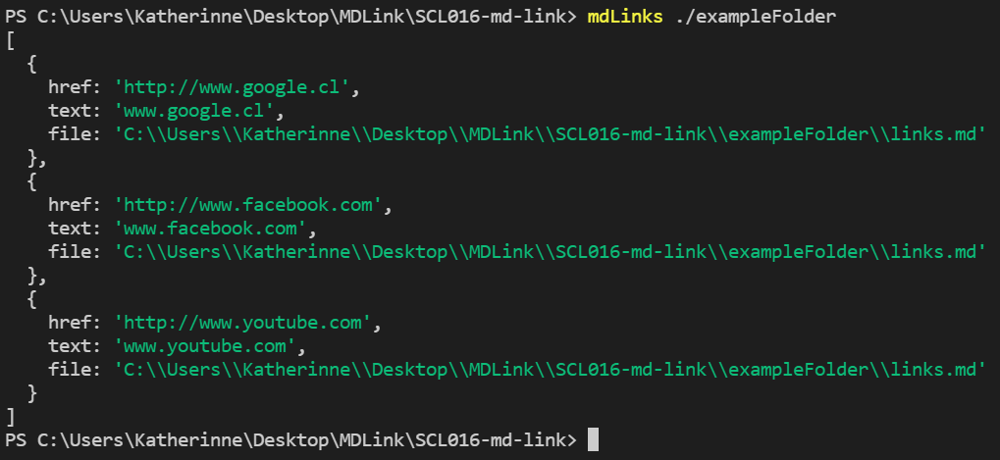
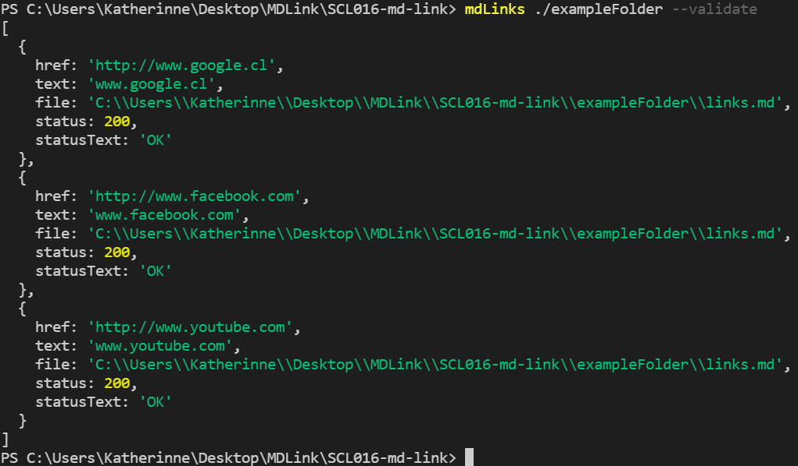
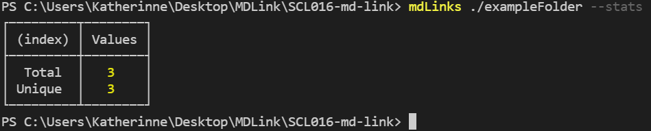
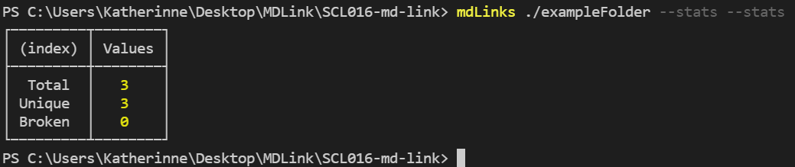

# Markdown Links 

 Esta librería te permitirá analizar tus archivos `Markdown` para extraer sus links, verificar su estado o entregar estadísticas.

## Instalación
 Para instalar este módulo debes ingresar el siguiente código en la terminal:

```sh
npm install https://github.com/k-garrido/SCL016-md-link
```
## Implementación
### Uso en la línea de comando de la terminal

El usuario puede realizar las siguientes acciones desde la terminal 	
*	Ver links del archivo MD

    Esta opción te  permitirá extraer los links de tu archivo .md y mostrar información detallada en un array de objetos, donde cada objeto será representado por un link y contendrá las siguientes propiedades: 

    - HREF: Mostrara el URL.

    - Text: Mostrara el texto que  había dentro del ancla.

    - File: Mostrara la ruta  del archivo  en donde se encontró ese link.

  Para poder  utilizar esta opción debes ingresar en la terminal lo siguiente:

```sh
mdLinks + la ruta de tu archivo o directorio
```
Como se muestra en la siguiente imagen:



*	--validate:

    Esta opción ejecutara una petición HTTP por cada link y nos especificara si el link es válido o no. Si se ejecuta la petición correctamente se agregaran 2 secciones en nuestro objeto de arrays, el primero es “status” el cual nos  mostrara el código 200  si el link es válido o 404 si el link es invalido y el segundo es “statusText” el cual nos mostrara un OK o FAIL en caso de que el link funcione correctamente o no.

  Para poder  utilizar esta opción debes ingresar en la terminal lo siguiente:


```sh
mdLinks + la ruta de tu archivo o directorio + --validate
```
Como se muestra en la siguiente imagen:



*	--stats

    Esta opción nos mostrara una pequeña tabla  la cual nos mostrara la siguiente información:

	- Unique: Mostrara cuantos links únicos existen en el archivo .md.

	- Total: Mostrara el total de links en el archivo .md.

  Para poder  utilizar esta opción debes ingresar en la terminal lo siguiente:

```sh
mdLinks + la ruta de tu archivo o directorio + --stats
```
Como se muestra en la siguiente imagen:



* --validate –stats:

   Esta opción nos motrara una tabla con la siguiente información: 

  - Total: Mostrara el total de links en el archivo .md.
  - Unique: Mostrara cuantos links únicos existen en el archivo .md.
  - Broken: Mostrara la cantidad de links que no están funcionando correctamente.

Para poder  utilizar esta opción debes ingresar en la terminal lo siguiente:

```sh
mdLinks + la ruta de tu archivo o directorio + --validate + --stats
```
Como se muestra en la siguiente imagen:



### Uso de la api 

Para poder usar md-links en tu proyecto primero debes importar el módulo de la siguiente manera:

```sh
Const mdLinks = require(‘md-links’);
```
Luego puedes llamar a nuestra función junto con sus argumentos, como se muestra a continuación:

```sh
mdLinks.md.mdLinks(path,options);
```

-- Path es la ruta a tu archivo o directorio

-- Las opciones pueden ser {validate:true} o {validate:false}


